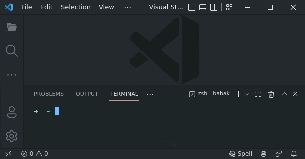

# Copy/Pipe From Terminal (`cp2code`/`tee2code`)

Copy/Pipe data from the integrated terminal to a new editor/tab in VS Code.



## Use **`cp2code`** or **`tee2code`**

This is simply done by piping the output of any shell command to the **`cp2code`** (or **`tee2code`** if you wouldn't want to end the piping chain), like:

```sh
ls ~ | cp2code
```

The other helper command, **`tee2code`**, is useful when you'd want to take copies in different stages of a piping chain, or if you simply want to print the output stream on the terminal as well. For example:

```sh
ls -1 . | tee2code | xargs md5sum | tee2code | sort | cp2code
```

## Copy/Pipe data

To copy/pipe data from the integrated terminal into a new editor/tab, follow these steps:

1. Open a new integrated terminal (<kbd>Ctrl</kbd>+<kbd>`</kbd>).

1. Prepare the output stream you'd like to copy into VS Code and pipe into to **`cp2code`** (or **`tee2code`** if you wouldn't want to end the piping chain). For example something like this:

   ```sh
   ls -1 / | sort | cp2code
   ```

   or

   ```sh
   ls -1 / | tee2code | sort 
   ```

1. Now you'd see a new editor with the content you just piped.

ℹ️ You may see an unknown command (something like `_bp=...`) being executed in the newly opened terminal window. That's all OK. It's just the definition of a shell function named `cp2code` (and `tee2code`), which does the copy/pipe procedure. 🍏

## Toggle ON/OFF

You can toggle ON/OFF the extension via the `Copy From Terminal: Toggle (Enable/Disable)` command. You can also do this via the settings UI or JSON file (`vscode-copy-from-terminal.enabled`).

⚠️ **For now, this extension is just available for UNIX-compatible systems (Linux & macOS).**
